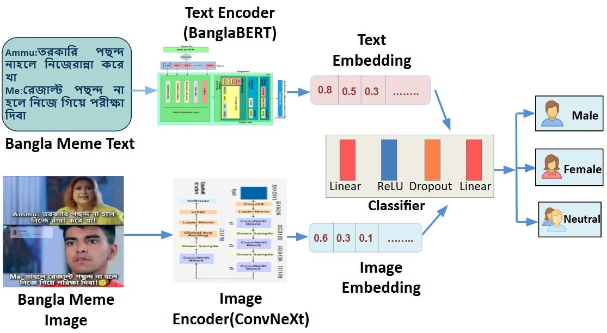
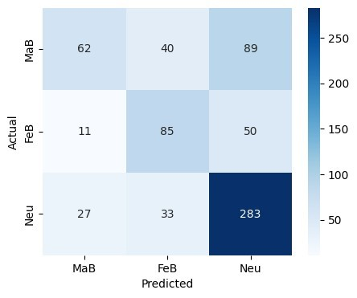

# Behind the Laughter:Uncovering Gender Bias in Code-Mixed Bangla Memes
- **Authors:** Labanya Saha, Jannatul Ferdusi, Paria Chowdury, Jawad Hossain, Noor Mairukh Khan Arnob
- **Accepted at:** ACL 2026 Workshop on Language Technology for Equality, Diversity and Inclusion (LT-EDI 2026)
- **Give our paper a read:** [here](https://openreview.net/group?id=aclweb.org/ACL/2026/Workshop/LT-EDI/Authors&referrer=%5BHomepage%5D(%2F))
- **Abstract** Bangla memes are widely used on social media to express humor and social commentary, yet computational analysis of gender bias in Bangla memes remains largely unexplored. In this work, we present a multimodal framework for detecting gender bias in Bangla memes by jointly analyzing textual and visual content. We construct a dataset of 6,846 Bangla and Banglish code-mixed memes annotated into three categories: male-biased, female-biased, and neutral. For textual representation, we use BanglishBERT, while visual features are extracted using ConvNeXt, and the two modalities are fused for final classification. Our best-performing model, ConvNeXt + BanglishBERT, achieves accuracy of 0.67 and an F1-score of 0.63, outperforming several multimodal baselines. The results demonstrate the effectiveness of multimodal learning for understanding culturally nuanced and code-mixed meme content in low-resource languages.
- ## Framework Architecture

### Label Distribution
| Category | Samples |
|---|---|
| Male-biased | 1,935 |
| Female-biased | 1,470 |
| Neutral | 3,441 |
## Distribution of Post Categories by Occurrence and Percentage

| Post Category | Count | Percentage |
|---------------|------:|-----------:|
| Male → Male | 631 | 9.22% |
| Male → Female | 347 | 5.07% |
| Male → Neutral Memes | 504 | 7.36% |
| Female → Male | 170 | 2.48% |
| Female → Female | 376 | 5.49% |
| Female → Neutral Memes | 281 | 4.10% |
| Page → Male | 1134 | 16.56% |
| Page → Female | 748 | 10.93% |
| Page → Neutral Memes | 2655 | 38.78% |
## Results

| Model | Accuracy | Precision | Recall | F1-Score |
|------|-----------:|-----------:|--------:|----------:|
| ConvNeXt + Sentence-Transformer | 0.56 | 0.53 | 0.48 | 0.48 |
| ResNet50 + Sentence-Transformer | 0.55 | 0.53 | 0.44 | 0.43 |
| ResNet50 + BanglishBERT | 0.65 | 0.63 | 0.60 | 0.61 |
| ViT + BanglishBERT | 0.66 | 0.65 | 0.60 | 0.61 |
| ViT + Sentence-Transformer | 0.57 | 0.56 | 0.48 | 0.49 |
| **ConvNeXt + BanglishBERT** | **0.67** | **0.66** | **0.61** | **0.63** |
The **ConvNeXt + BanglishBERT** achieved the best performance.
-
